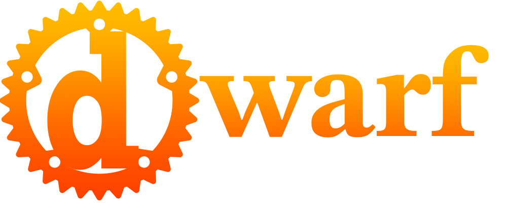
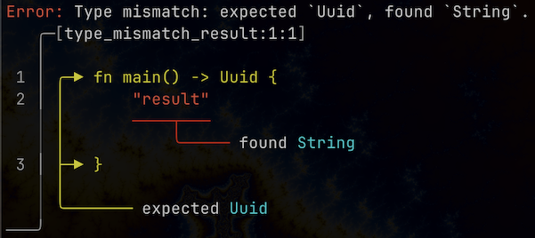
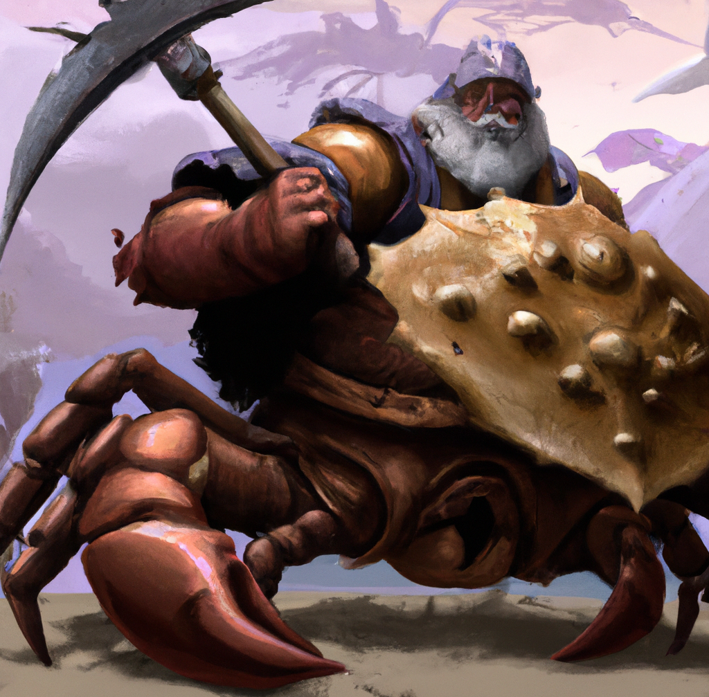

<h1 align="center"></h1>


[](https://codecov.io/gh/uberFoo/dwarf)


# The dwarf Programming Language

dwarf is a programming language based heavily upon, and implemented in, [Rust](https://www.rust-lang.org).
It is a typed, (optionally) asynchronous, interpreted language.
dwarf supports all the usual primitive types like int, float, bool, and string.
It also has support for arrays, UUIDs, structs and enums, with tuples on the way.
dwarf supports generic parameters to functions as well as structs and enums.
Three is currently a compiler/VM, an interpreter, and a REPL.

> **Think of dwarf as Rust on easy mode!**
>
> I think dwarf could be a good introduction to Rust.
> It has most of the syntax, while leaving out the borrow checker.
> However it also has some foot-guns, like shared mutable references.


There is a [book 📒](https://uberfoo.github.io/assets/docs/dwarf/introduction.html) in progress.
Check it out!

*Nota Bene*: This is a work in progress.

I appreciate feedback.
Let me know if you love it, or hate it.
There are likely as not bugs, and corner cases yet to be uncovered.
If you run across something, file a bug report, and I'll git a fix out ASAP.

> **Free Stuff**
>
> I'm giving away dwarf stickers to anyone who files a bug report!

## Help Wanted

This thing has grown beyond my ability to keep everything working while still making forward progress.

> **For Instance**
>
> I've been working on the virtual machine, and not worrying overmuch about the REPL.
> Unfortunately it's now impossible to get to the REPL because of some bug buried in `main`.
> If I take the time to fix the REPL, then that's time away from making progress on the VM.
> I'm not using the REPL right now, so it's not going to get fixed.

If anyone is interested in hacking on this thing, that would be cool!
I'd be happy to answer questions and/or give a code walk-through.
Documentation is something I really need to work on, and perhaps other's working on the project would inspire me to get some done.

## Installation

The easiest thing to do is to download a [release](https://github.com/uberFoo/dwarf/releases).

### MacOS

MacOs Gatekeeper will complain about the binary being from an unidentified developer, or that it can't check for malware.
Give this a go on the command line, replacing the path with the path to the downloaded binary:

```bash
xattr -d com.apple.quarantine ~/Downloads/dwarf-aarch64-apple-darwin
```

### Linux

> ⚠️ **Linux Build Problem:** I'm having some issues compiling a dependency on linux.

### Building from Source

The next easiest thing to do is to clone the repo and build it yourself.
Of course you'll need to have [rust installed ](https://rustup.rs).

```bash
git clone https://github.com/uberFoo/dwarf.git
cd dwarf
cargo xtask install
```

## Beautiful Error Messages!



Check out [ariadne](https://docs.rs/ariadne/latest/ariadne/) and you too can have cool error messages!

## Goals

* Typed, interpreted DSL
* Easily embeddable
* Rust-like syntax

## On the Horizon

These are the thins that spring to mind when I think of what I'd most like to do next with dwarf.
In no particular order:

* [x] async
* [ ] VSCode integration
* [x] Multiple files (use items)
* [x] enums
* [x] lambdas
* [x] Compiler for VM
* [ ] Visibility modifiers
* [x] Generics
* [ ] Macros (Yes, and I don't know why other interpreted languages don't have them. Am I crazy?)
* [x] Extensions via plugins
* [ ] Char type
* [x] if let expressions
* [ ] Doc Comments, with Doc Tests
* [x] match expression

### Supertype / subtype hierarchies

There will be some sort of support for OO-like behavior.
Minimally we need inheritance, and probably polymorphism.

## Syntax

dwarf syntax is (nearly) a strict subset of Rust's.
In fact, I use the Rust language syntax parser in `vscode` to highlight, navigate, and edit Dwarf source.

The bits that are missing include iterators, enumerations, paths, visibility modifiers, generics (for now), and the list goes on.

## REPL

dwarf has a REPL.
Pass the `-r` flag to start it.

## License

dwarf is distributed under the terms of both the MIT license and the Apache License (Version 2.0).

See [LICENSE-APACHE](LICENSE-APACHE), [LICENSE-MIT](LICENSE-MIT) for details.

<h1 align="center"></h1>
