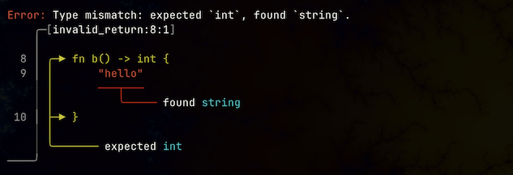

<h1 align="center"></h1>


[](https://codecov.io/gh/uberFoo/dwarf)


# The dwarf Programming Language

dwarf is a programming language based heavily upon, and implemented in, [Rust](https://www.rust-lang.org).
The language is interpreted (and slow) with a VM (fast-ish) on the way.

There is a [book 📒](https://uberfoo.github.io/assets/docs/dwarf/introduction.html) in progress.
Check it out!

*Nota Bene*: This is a work in progress.
The parser is pretty good, but not perfect, at recognizing the language.
However, the errors that it reports aren't always useful.

I appreciate feedback.
Let me know if you love it, or hate it.
There are likely as not bugs, and corner cases.
File a bug report, and let me know.

## Installation

The easiest thing to do is to download a [release](https://github.com/uberFoo/dwarf/releases).

The next easiest thing to do is to clone the repo and build it yourself.
Of course you'll need to have [rust installed ](https://rustup.rs).

```bash
git clone https://github.com/uberFoo/dwarf.git
cd dwarf
cargo install --path . --bin dwarf`
```


Once you have a binary, give it a whirl:

```bash
dwarf https://raw.githubusercontent.com/uberFoo/dwarf/develop/mandelbrot.tao -- 50
```

## Beautiful Error Messages!


Check out [ariadne](https://docs.rs/ariadne/latest/ariadne/) and you too can have cool error messages!

## Goals

* Typed, interpreted DSL
* Easily embeddable
* Rust-like syntax

## Non-Goals

* Interpreter / debugger performance
* 100% Rust feature / syntax parity

## On the Horizon

These are the thins that spring to mind when I think of what I'd most like to do next with dwarf.
In no particular order:

- [ ] VSCode integration
- [ ] Multiple files (use items)
- [ ] enums
- [x] lambdas
- [ ] Compiler for VM
- [ ] Visibility modifiers
- [ ] Generics
- [ ] Macros (Yes, and I don't know why other interpreted languages don't have them. Am I crazy?)
- [ ] Extensions via plugins
- [ ] Char type
- [ ] if let expressions
- [ ] Doc Comments, with Doc Tests

### Supertype / subtype hierarchies

There will be some sort of support for OO-like behavior.
Minimally we need inheritance, and probably polymorphism.

### Virtual Machine

There's a sort-of hybrid-VM currently, but no compiler.

## Syntax

dwarf syntax is a strict subset of Rust's.
In fact, I use the Rust language syntax parser in `vscode` to highlight, navigate, and edit Dwarf source.

The bits that are missing include iterators, enumerations, paths, visibility modifiers, generics (for now), and the list goes on.

## REPL

## Debugger

## Architecture

### Parser

There is a hand written parser that takes care of turning the source into an AST.
The parser is great at parsing good code, and terrible and everything else.
Fixing this is on my todo list.

### Compiler

The AST is "compiled" into an in-memory representation that is comprised of the generated code.
It's a model, and I should probably include pictures, or some way to look at it, despite it's terrible layout.
The model looks like a standard UML class diagram, and it may as well be.
I sort of turn it sideways and treat it as an AST.

So what the compiler really does is translate one AST into another.
It really does more than that though.
It resolves as much type information as it can.
It resolves names.
It may do more, I'll have to look.

### Interpreter

After the compiler comes the interpreter.
It reads the model/AST and executes it.
I think that the default is to execute a `main` function.

If you start in the REPL, you get the execution in a loop.

### Debugger

## License

dwarf is distributed under the terms of both the MIT license and the Apache License (Version 2.0).

See [LICENSE-APACHE](LICENSE-APACHE), [LICENSE-MIT](LICENSE-MIT) for details.

<h1 align="center"></h1>