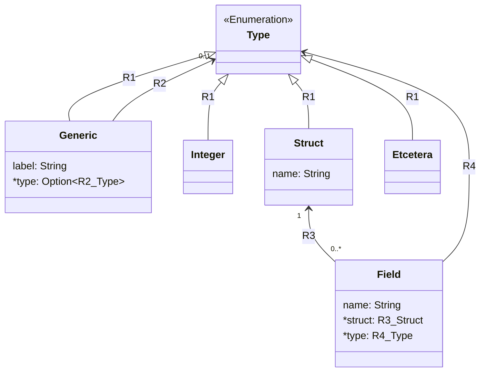

# Generic Types

Today we're going to talk about how generics are implemented in dwarf.
Generics are a type of polymorphism, which is a way to have one chunk of code work with multiple types.
In the generic code, the abstract type is specified by a single capital letter.
When the code is compiled the abstract type is replaced with a concrete type.
The concrete type is inferred from the call site.

Below are examples of a generic function and a generic type, as well as a usage of each.

```dwarf
// This is a generic function.
// It takes a type T and returns a value of type T.
fn id<T>(x: T) -> T {
    x + 42
}

// This is a generic type.
// It takes a type T and stores a value of type T.
 struct Box<U> {
     value: U,
 }

 impl Box<U> {
     fn display(self) {
         print("Box<{0}>\n".format(self.value));
     }
 }

fn main() {
    // Here we call the generic function with an int.
    let x = id(54);
    print("{0}\n".format(x));
    chacha::assert(x == 96);

    // And here with a float.
    let y = id("Hello World, the answer is ");
    print("{0}\n".format(y));
    chacha::assert(y == "Hello World, the answer is 42");

    // Here we create a Box that stores a float.
    let z = Box{ value: 0.42 };
    z.display();
    chacha::assert(chacha::typeof(z.value) == "float");

    // Let's box a list now.
    let α = Box{ value: [1, 2, 3] };
    α.display();
    chacha::assert(chacha::typeof(α.value) == "[int]");

    // Let's try something interesting...
    let β = Box{ value: id("") };
    β.display();
    chacha::assert(chacha::typeof(β.value) == "string");
    chacha::assert(β.value == "42");
}
```

In the examples above notice that the generic labels, `T` and `U`, are used in the function and type definitions.
The code in the `main` function uses the generic function and type with no label to be seen.
That is because concrete types are used in the non-generic, non-definition code.

## Requirements

So what does it take to make this happen in dwarf?
Well, like everything else, there's a parser piece, an extruder piece, and an interpreter piece.

The {{i: parser}} reads the input and looks for generic annotations where appropriate.
The {{i: extruder}} takes the output of the parser and builds the AST, substituting the generic placeholder with a concrete type.
The {{i: interpreter}} then takes the AST and evaluates it.

### Parser

Rather than go into how the parser works, which is covered in the [parser](../arch/parser.md) section of the hacker book,

### Extruder

#### {{i: Grace}} {{i: AST}} Model

Below is an approximation of (a part of) the model that is used to generate (a part of) the dwarf abstract syntax tree ([AST](https://en.wikipedia.org/wiki/Abstract_syntax_tree)).
The diagram is UML-ish, and says that **Type** is a supertype, and everything connected by an **R1** label is it's subtype.
**Field** has two relationships, **R3** and **R4**, to **Struct** and **Type** respectively.
These relationships are backed by "referential attributes" whose purpose is to store the relationship data.
In the case of **Field**, **struct** formalizes **R3** and **type** formalizes **R4**.

The points worth reflecting upon are that **Type** is a generalization over all of the dwarf types.
Also, **Field** and **Generic** both have relationships to **Type**. separate from **R1**.



There is a real model that is much more extensive that is used to generate the AST code.
Below is the generated code for the actual **Type**, called `ValueType` in the code.

```rust
pub enum ValueType {
    Char(Uuid),
    Empty(Uuid),
    Enumeration(Uuid),
    Function(Uuid),
    Future(Uuid),
    Generic(Uuid),
    Import(Uuid),
    Lambda(Uuid),
    List(Uuid),
    ObjectStore(Uuid),
    Plugin(Uuid),
    Range(Uuid),
    Struct(Uuid),
    Task(Uuid),
    Ty(Uuid),
    Unknown(Uuid),
}
```

The `Ty` variant is actually imported from yet another, fundamental, model.
It's definition is below, ond contains what one might expect, given what is missing from above.
These are the fundamental modeling types, whereas above are the dwarf types.

```rust
pub enum Ty {
    Boolean(Uuid),
    External(Uuid),
    Float(Uuid),
    Integer(Uuid),
    Object(Uuid),
    String(Uuid),
    Uuid(Uuid),
}
```

```dwarf
let definition = "
    struct Box<T> {
        value: T,
    }
";

print(definition);
let ast = chacha::parse(definition);
print(ast);
```

Mention something about assuming the type of a field expression, and then having to use that to check type.

### Interpreter