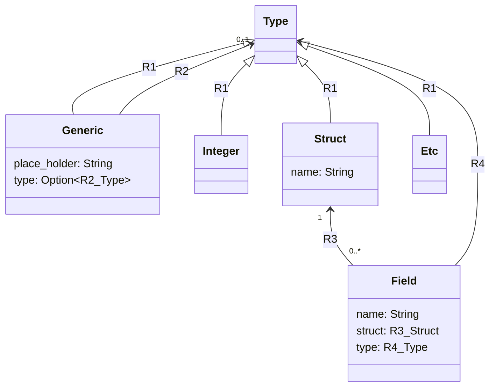

# Generic Types

For those not in the know, generics are a type of polymorphism.
They allow one to write code that works with many distinct types.
This is facilitated by supplying a generic type in your generic code, e.g., a function or a struct.
A concreted type is supplied at the usage site.
During compilation, the generic type is replaced with the concrete type.

Here's a simple example:

```dwarf
// This is a generic function.
// It takes a type T and returns a value of type T.
fn id<T>(x: T) -> T {
    x
}

// This is a generic type.
// It takes a type T and stores a value of type T.
struct Box<T> {
    value: T,
}

impl Box<T> {
    fn display(self) {
        print("Box<{0}>\n".format(self.value));
    }
}

fn main() {
    // Here we call the generic function with an int.
    let x = id(42);
    print("{0}\n".format(x));

    // And here with a float.
    let y = id(9.6);
    print("{0}\n".format(y));

    // Here we create a Box that stores an int.
    let z = Box{value: "Hello, World!"};
    print("{0}\n".format(z));
    z.display();

    // Let's box a list.
    let α = Box(value: [1, 2, 3]);
    print("{0}\n".format(α));
    α.display();
}
```


## {{i: Grace}} {{i: AST}} Model


Below is an approximation of (a part of) the model that is used to generate (a part of) the dwarf abstract syntax tree ([AST](https://en.wikipedia.org/wiki/Abstract_syntax_tree)).
The points worth reflecting upon are that `Type` is a generalization over all of the dwarf types.
Also, `Struct` and `Field` both have relationships to `Type`. separate from `R1`.



```dwarf
let definition = "
    struct Box<T> {
        value: T,
    }
";

print(definition);
let ast = chacha::parse(definition);
print(ast);
```

Mention something about assuming the type of a field expression, and then having to use that to check type.