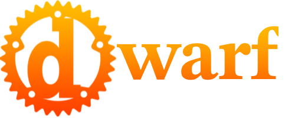

# Introduction

Welcome!
This brief introduction will outline the status of dwarf, and set the stage for what's to come.

## {{i:Hello World}}

Every language deserves one, so let's get it out of the way.
Go ahead and click the run button in the top right corner.

```dwarf, editable
fn main() {
    let name = "World";
    print("Hello " + name + "!");
}
```

Feel free to edit the code — replace `World` with your name maybe?
I know you want to. 😀

## A brief story of dwarf

Dwarf started life as a DSLfor another project.
I've had so much fun with it, I want to see if anyone else might find it generally useful.
Not that it's quite ready for production.
This is still very much alpha software.

Because dwarf is a DSL, the focus was not language design.
I'm pretty sure if I had allowed myself that freedom that I'd still be working on it.
And it would be weird...

So I based it on Rust.
It shares most of it's syntax with Rust, while mostly maintaining the behavior of other interpreted languages.
The one big exception is that dwarf is typed, like Rust.

That said, there is a lot missing.
Traits for example are not to be found.
Neither are there generics, or iterator adaptors.
Enums are also a glaring absence.
Some of these are missing only because I wanted to get this out the door.
Others, like traits, may not have a place, and they may.
It's all very unclear at this point, and will likely depend on demand.
Other's, and those of my needs.

Right now dwarf is also very slow.
(He's still working on his tunneling gear apparently.)
It's slow because it's interpreted, and the foundations of the interpreter are not really built for speed.
That said, there is a VM currently in the works, and it's somewhat integrated with the interpreter.

This integration is currently taking the form of compiled functions that the interpreter can call to speed things up.
I've done that with the [{{i: Mandelbrot}}](./tutorials/mandelbrot.md) example.
There is also work underway for including inline assembly in dwarf files.
Of course that will not be necessary once I've finished the VM.and it' compiler.

Along the way I wrote a "debugger" and a REPL.
The debugger is very basic.
You have to set debugger statements in your code to get it to stop — there is no way to set a breakpoint form the tool.
Once the program has stopped single stepping through the code is possible.
There is also a "run" button to start it going again.

I began work on a DAP for VSCode (and others), but the documentation on the wire protocol is not easy to find.
I put this on the shelf in favor of just publishing something a little more polished.

The REPL is really nice for playing around with the language.
It's also a great way to prototype ideas.


So, thanks for taking a look, I hope you enjoy what you find!

> A note regarding the code in this book:
>
> The code snippets contained herein are executed by AWS Lambda.
> I've mentioned elsewhere that the interpreter is not fast.
> Running as a lambda, it's even not faster... er, slower. 😎
