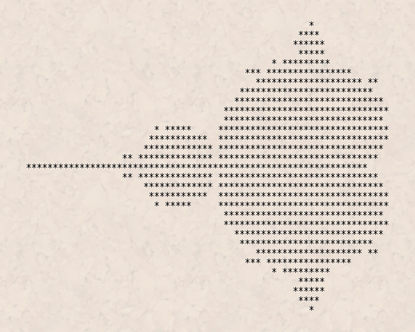

# Mandelbrot Set

I imagine that everyone is faimilar with the Mandelbrot set.
It's a fractal that is generated by iterating a function over the complex plane.
It makes really nifty pictures.
.

Doing this in dwarf is not as pretty, as dwarf can only output to the terminal using the `print` expression.
So ours is going to end up looking more like the first-ever image of the set:
.

The function that we'll be iterating to draw the set is really simple: \\(f(z) = z^2 + c\\), where \\(z\\) and \\(c\\) are both complex numbers.
Basically, you fall within the set if \\(z\\) does not go to \\(\infty\\) when you iterate the function.

I mentioned that the set is over the complex plane, and dwarf doesn't grok complex numbers.
That means that we'll need to invent our own complex type.
As per above, we'll need to support addition and squaring.
So, let's get started!
